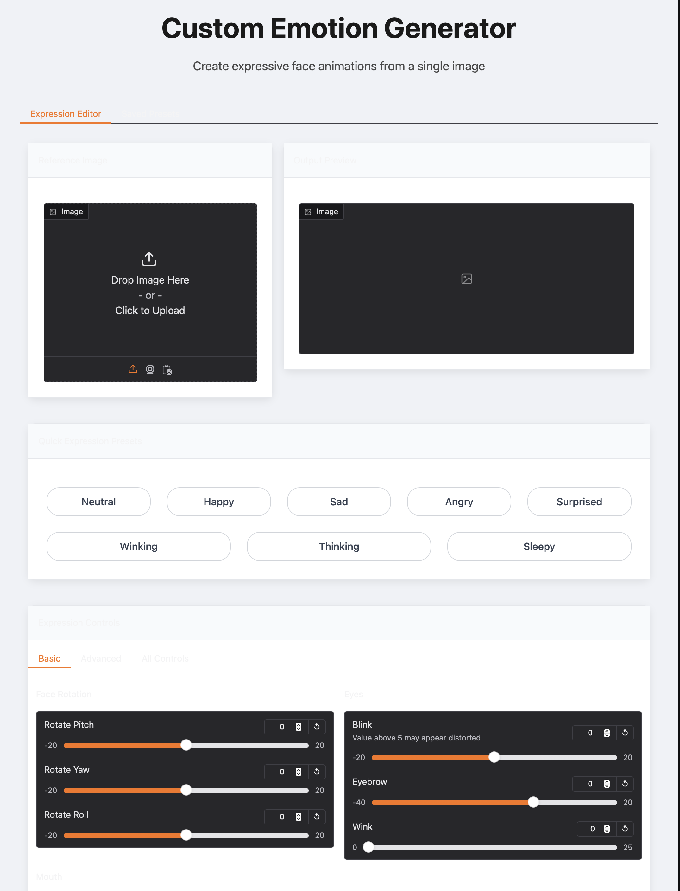

# Custom Emotion Generator

A powerful tool that generates expressive facial animations from a single reference image. This application allows you to create various emotional expressions by manipulating facial features through an intuitive interface.

## Overview

Custom Emotion Generator uses advanced AI techniques to manipulate facial expressions in still images. With a simple and intuitive UI, you can adjust various parameters to create realistic emotional responses, including happiness, sadness, anger, surprise, and more.



## Features

- **Preset Expressions**: Choose from predefined emotional states like Happy, Sad, Angry, Sleepy, Winking, Thinking, and Surprised
- **Custom Expression Controls**: Fine-tune specific facial aspects:
  - Face rotation (pitch, yaw, roll)
  - Eye movements (blink, eyebrow, wink, pupil position)
  - Mouth expressions (AAA, EEE, WOO, smile)
- **Advanced Settings**: Adjust technical parameters for better results
- **Image Restoration**: Optional enhancement using RealESRGAN
- **Custom Presets**: Save and load your favorite expression settings
- **User-Friendly Interface**: Intuitive controls and clear feedback


## Technical Details

### Pretrained Models

This application uses the LivePortrait model architecture, which is based on facial expression manipulation techniques. The model requires pretrained weights that should be placed in the specified model directory.

Required pretrained models:
- LivePortrait facial animation model
- RealESRGAN for optional image restoration

### System Requirements

- Python 3.7+
- CUDA-compatible GPU recommended for faster processing (but CPU-only mode is supported)
- Minimum 8GB RAM
- 2GB available disk space for models and temporary files

## Installation

1. Clone the repository:
```
git clone https://github.com/username/custom-emotion-generator.git
cd custom-emotion-generator
```

2. Install dependencies:

   **For GPU support (CUDA 12.4):**
   ```
   pip install -r requirements-gpu.txt
   ```

   **For CPU only:**
   ```
   pip install -r requirements-cpu.txt
   ```

3. Download the pretrained models:
```
python download_models.py
```

### Requirements Files

**requirements-gpu.txt**:
```
--extra-index-url https://download.pytorch.org/whl/cu124
torch
torchvision
numpy>=1.26.4
opencv-python-headless
imageio-ffmpeg>=0.5.1
lmdb>=1.4.1
timm>=1.0.7
rich>=13.7.1
albumentations>=1.4.10
ultralytics==8.3.43
tyro
dill
gradio
gradio-i18n
```

**requirements-cpu.txt**:
```
# Torch will be automatically installed with following dependencies
numpy>=1.26.4
opencv-python-headless
imageio-ffmpeg>=0.5.1
lmdb>=1.4.1
timm>=1.0.7
rich>=13.7.1
albumentations>=1.4.10
ultralytics
tyro
dill
gradio
gradio-i18n
```

## Usage

### Running the Application

Launch the application with default settings:
```
python app.py
```

Or customize with command line arguments:
```
python app.py --model_dir /path/to/models --output_dir /path/to/outputs
```

### Command Line Options

| Argument | Description | Default |
|----------|-------------|---------|
| `--share` | Enable Gradio share link | False |
| `--inbrowser` | Auto-open browser | True |
| `--server_name` | Host name | None |
| `--server_port` | Server port | None |
| `--root_path` | Gradio root path | None |
| `--username` | Authentication username | None |
| `--password` | Authentication password | None |
| `--model_dir` | Models directory path | ./models |
| `--output_dir` | Output directory path | ./outputs |

### Using the Interface

1. **Upload a Reference Image**:
   - Choose a clear, front-facing portrait for best results

2. **Choose an Expression**:
   - Select a preset emotion, or
   - Adjust individual parameters manually

3. **Fine-tune Controls**:
   - Basic tab: Adjust fundamental expression parameters
   - Advanced tab: Fine-tune technical aspects
   - All Controls tab: Access all parameters in one view

4. **Generate the Result**:
   - Click "GENERATE" to process the image
   - Save the result or continue adjusting

5. **Save Custom Presets**:
   - Name and save your custom expressions
   - Load or delete saved presets as needed

## Expression Controls Guide

### Basic Controls

- **Rotate Pitch**: Tilt head up and down (-20 to 20)
- **Rotate Yaw**: Turn head left and right (-20 to 20)
- **Rotate Roll**: Tilt head sideways (-20 to 20)
- **Blink**: Control eyelid closure (-20 to 20)
- **Eyebrow**: Raise or lower eyebrows (-40 to 20)
- **Wink**: Add winking effect (0 to 25)
- **AAA**: Open mouth vertically (-30 to 120)
- **EEE**: Stretch mouth horizontally (-20 to 20)
- **WOO**: Create rounded mouth shape (-20 to 20)
- **Smile**: Add smiling or frowning effect (-2.0 to 2.0)

### Advanced Controls

- **Pupil X**: Move pupils horizontally (-20 to 20)
- **Pupil Y**: Move pupils vertically (-20 to 20)
- **Source Ratio**: Adjust influence of source image (0 to 1)
- **Face Crop Factor**: Control face framing (1.5 to 2.5)
- **Image Restoration**: Enable/disable enhancement

## Preset Expressions

The application comes with the following predefined expressions:

| Preset | Description |
|--------|-------------|
| Neutral | Default expression with no modifications |
| Happy | Uplifted expression with smile and raised eyebrows |
| Sad | Downturned expression with lowered eyebrows |
| Angry | Intense expression with furrowed brows |
| Sleepy | Tired expression with droopy eyelids |
| Winking | Playful expression with one eye closed |
| Thinking | Contemplative look with slight head tilt |
| Surprised | Startled expression with widened eyes |

## Implementation Details

### Model Architecture

The Custom Emotion Generator uses the LivePortraitInferencer class to handle the AI processing. The architecture works by:

1. Analyzing the input reference image to create a base representation
2. Applying transformation parameters to modify facial features
3. Generating the final output with the desired expression

### Expression Parameter Effects

Here's how the different parameters affect the generated expressions:

```
- rotate_pitch: Controls vertical head tilt
- rotate_yaw: Controls horizontal head rotation
- rotate_roll: Controls sideways head tilt
- blink: Affects eyelid closure
- eyebrow: Controls eyebrow height and curvature
- wink: Creates asymmetrical eye closure
- pupil_x/pupil_y: Controls pupil/eye gaze direction
- aaa/eee/woo: Controls different mouth shapes
- smile: Affects corners of the mouth
- source_ratio: Controls how much of the original image is preserved
```

### User Interface Structure

The UI is built with Gradio and structured into several components:

- Header section with title and description
- Main tabs for Expression Editor and Saved Presets
- Expression controls organized in Basic, Advanced, and All Controls tabs
- Quick preset buttons for common expressions
- Generate and Reset buttons for workflow control
- Custom CSS for enhanced visual appeal

## Demo

Watch a full video demonstration:

https://github.com/user-attachments/assets/667c85d8-d2d5-4bf0-8ea0-367c54d8734a


## Troubleshooting

- **Distorted Results**: Try adjusting the Face Crop Factor or reduce extreme parameter values
- **Slow Processing**: Disable Image Restoration for faster results
- **Poor Animation Quality**: Use a clearer reference image with good lighting and front-facing orientation
- **Memory Issues**: Close other applications or reduce image resolution

- 
## License

[Apache](LICENSE)

## Acknowledgements

- LivePortrait model architecture for facial animation
- RealESRGAN for image restoration
- Gradio framework for the web interface
- All contributors and beta testers
